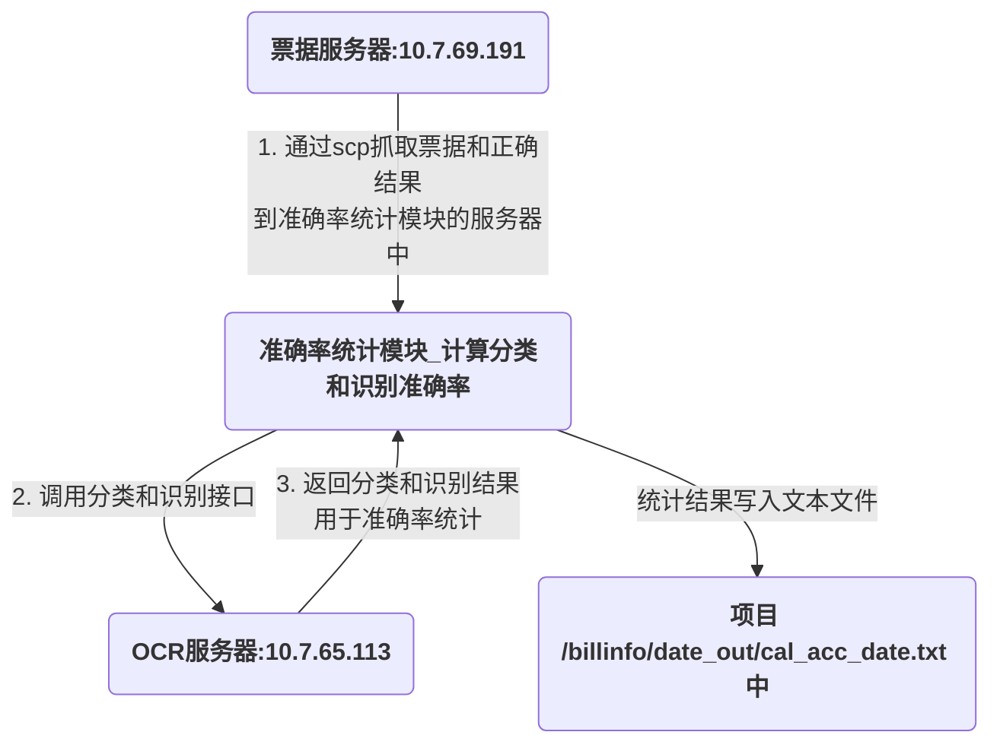
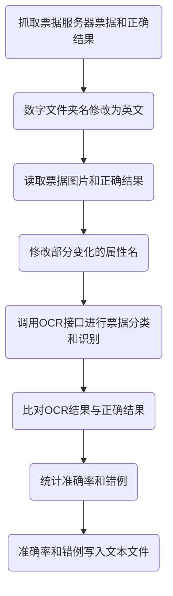

# 技术文档<br/>定时任务统计OCR分类和识别准确率

<p align="right" ><b>邓方进</pb>
<p align="right">2020年3月17日</p>

# 目录

[TOC]

<div STYLE="page-break-after: always;"></div>

# 0. 更新日志

20200317：

- [x] 更新说明文档

20200316更新：

- [x] 新增分类和识别错误统计模块，按照各张图片统计错误结果、按照各个要素统计错误结果。

20200310更新：

- [x] 新增定期定理的日志模块；

- [x] 将脚本功能模块化，便于阅读及二次开发；

- [x] 抓取数据的天数和每天运行的时间写进配置文件；

- [x] 修复票据服务为空文件夹或空文件导致的bug。

# 1. 引言

## 1.1 模块详细介绍

每天22点到**票据服务器**（10.7.69.191）抓取三天前的**票据图片和正确结果**（票据图片和正确结果由**科技部何苗**负责），通过调用OCR接口对票据图片进行**分类和识别**，并将**OCR预测结果与正确结果进行比对**，计算总体票据分类准确率、各类票据分类准确率、各票据各要素识别准确率，最终将上述统计结果输出到**文本文件**（输出格式见1.1.3）。

**模块对生产环境影响较小，原因如下：**

- 模块没有对外暴露服务端口；
- 模块在晚上运行，不影响白天的OCR调用；
- 每天只到票据服务器抓取一次数据，访问频率低；
- 模块只用单核CPU，占用率低；
- 模块每天只写一次且文件大小不超过1MB，磁盘IO占用率低。

### **1.1.1 比对原则：**

- **分类**：将OCR分类模型中返回的票据图片的分类结果，与票据服务器中该张票据的类型进行比较，若一致则表示此张票据分类正确，否则错误；（举例：OCR模型返回的票据类型为<u>业务委托书</u>，何苗提供的该票据也为<u>业务委托书</u>，则表示该票分类正确，如果该票OCR模型返回的类型是转账支票，则表示分类错误。）
- **识别**：将OCR识别模型中返回的票据图片上的**各个要素值**，**分别**与票据服务器中提供的对应要素值进行比较，并分别统计各个要素的识别准确率，若完全一致则识别正确，否则错误。（举例：OCR模型返回的大写金额为"<u>壹佰元整</u>"，票据服务器中提供的该票据的大写金额为"<u>壹佰元整</u>"，则表示该张票据的大写金额识别正确，如果OCR模型返回大写额大写金额为"贰佰元整"，则表示该张票据的大写金额识别错误。）

### **1.1.2 拓扑图：**



### **1.1.3 文本文件示例**（**该结果是由自己编的假数据生成的，仅做格式参考**）：

#### 1.1.3.1 OCR准确率统计结果

路径：`billinfo/[date]_out/cal_acc_[date].txt`中，其中date为yymmdd格式。

```
20200228 OCR准确率统计结果:
一. 分类准确率:
所有分类(581张):99.14%
1. 进账单(清分)(100张):99.00%
2. 业务委托书(100张):99.00%
3. 预算拨款凭证(89张):98.88%
4. 转账支票(100张):100.00%
5. 其他凭证(78张):100.00%
6. 进账单(清分无收账通知)(100张):99.00%
7. 进账单(贷方凭证)(14张):92.86%

二. 识别准确率
1. 业务委托书(100张):
  委托日期(yymmdd):null
  票据/凭证号码:89.00%
  委托人全称:77.00%
  委托人账号或地址:98.00%；
  收款人/持票人名称:84.00%
  收款人账号或住址:97.00%
  大写金额:89.00%
  小写金额:94.00%
  支付密码:100%
  用途/摘要:85.00%
  附件信息/备注:null

注:null表示未纳入统计
不足100张的表示该票据当前数量不足100张
```

#### 1.1.3.2 各张图片统计错误结果

路径：`billinfo/[date]_out/res_imgs_false_[date].json`中，其中date为yymmdd格式。

```json
{
    "classify_false": [  // 错误分类
        {
            "path":  // 票据路径
            "billinfo\\20200229\\jzdw\\6263399849_20190730\\6263399849_20190730.jpg",
            "ture_res": "进账单",  // 真实票据名称
            "prob_res": "业务委托书"   // 预测的错误票据名称
        }
    ],
    "recognize_imgs_false": {  // 错误识别
        "ywwts": [  // 票据名称
            [
            "billinfo\\20200229\\ywwts\\6263399849_20190736\\6263399849_20190736.JPG",  // 票据路径
 			"billinfo\\20200229\\ywwts\\6263399849_20190736\\6263399849_20190736.txt",  // 票据真实属性名属性值文件路径
                {
                    "raw": {  // 当前票据真实的属性名和属性值
                        "大写金额": "壹佰元整",
                        "小写金额": "100.00",
                        "支付密码": ""
                    },
                    "prob_recognize": {  // 各字段是否正确：正确True；错误False
                        "大写金额": false,
                        "小写金额": false,
                        "支付密码": true
                    },
                    "res_recognize": {  // OCR模型预测的结果
                        "委托日期(yymmdd)": null,
                        "票据/凭证号码": null,
                        "委托人全称": null,
                        "委托人账号或地址": null,
                        "收款人/持票人名称": null,
                        "收款人账号或住址": null,
                        "大写金额": "伍仟贰佰元整",
                        "小写金额": "5200.00",
                        "支付密码": "",
                        "用途/摘要": null,
                        "附件信息/备注": null
                    }
                }
            ],
        ]
    }
}
注:null表示未纳入统计
```

#### 1.1.3.3 各个要素统计错误结果

路径：`billinfo/[date]_out/res_tags_false_[date].json`中，其中date为yymmdd格式。

```json
{
    "classify_false": [  // 错误分类
        {
            "path":  // 票据路径
            "billinfo\\20200229\\jzdw\\6263399849_20190730\\6263399849_20190730.jpg",
            "ture_res": "进账单",  // 真实票据名称
            "prob_res": "业务委托书"  // 预测的错误类别
        }
    ],
    "res_tags_false": {  // 错误识别
        "ywwts": {  // 当前票据名称
            "小写金额": [  // 表示当前票据的属性名
                {
                    "path":  // 票据路径
               "billinfo\\20200229\\ywwts\\6263399849_20190736\\6263399849_20190736.JPG",
                    "ture_res": "100.00",  // 表示真实属性值
                    "prob_res": "5200.00"  // 表示预测的错误属性值
                }
            ],
            "大写金额": [
                {
                    "path":
               "billinfo\\20200229\\ywwts\\6263399849_20190736\\6263399849_20190736.JPG",
                    "ture_res": "壹佰元整",
                    "prob_res": "伍仟贰佰元整"
                }
            ]
        }
    }
}
注:null表示未纳入统计
```

### 1.1.4 项目详情

|    类型     |                 说明                  |
| ----------- | ------------------------------------ |
| 模块名称     | 定时任务统计OCR分类和识别准确率         |
| 需求提出单位 | 重庆农村商业银行金融创新部、集中作业中心 |
| 需求编写单位 | 北京英孚泰克信息技术股份有限公司        |
| 编写人员     | 邓方进，17300244864                   |

## 1.2 运行环境

| 类型       |                                                                   软件                                                                    |
| :--------- | ----------------------------------------------------------------------------------------------------------------------------------------- |
| 系统       | Linux                                                                                                                                     |
| Python版本 | Python 3.6                                                                                                                                |
| Python库   | pytest-shutil==1.7.0<br/>opencv-python==3.4.4.19<br/>requests==2.23.0<br/>chardet==3.0.4<br/>schedule==0.6.0<br/>requests_toolbelt==0.9.1 |
| 依赖软件   | sshpass-1.06                                                                                                                              |
| 其他依赖   | 票据服务器与OCR端口22互访<br />其他依赖详见config/config.json                                                                                |

## 1.3 模块文件树

**项目目录结构：**

```linux
│  run_schedule.py               # 后台定时运行主程序
├─billinfo                       # 票据及属性值目录
│  ├─20200229                    # 按日期进行抓取的目录
│  │  ├─jzdw         
│  │  └─ywwts
│  │      ├─6263399848_20190734
│  │      │      6263399848_20190734.JPG
│  │      │      6263399848_20190734.txt
│  │              
│  └─20200229_out                 
│          cal_acc_20200229.txt   # 每天的统计结果
│          imgs_txts_res.json     # 所有的分类和识别结果 
│          res_imgs_false.json    # 按照各张图片统计错误结果
│          res_tags_false.json    # 按照各个要素统计错误结果
├─config
│      config.json            # 主要配置文件
│      num2eng.json           # 数字文件夹名转英文
│      ywwts_new2old.json     # 业务委托书属性名更新
├─log
│      calculateAccuracy.log  # 日志文件
├─modules
│  │  calculate.py            # 准确率计算模块
│  │  cal_acc.py              # 准确率计算主程序
│  │  ocr_tool.py             # ocr 接口模块
│  │  os_tools.py             # 文件操作模块
│  │  readfiles.py            # 文件读取模块
├─requirements                # 依赖
├─util
│  │  log_util.py             # 日志模块
│  │  test_ocr_url.py         # flask模拟ocr服务(测试用)

```

# 2. 功能说明

**运行流程图：**



**运行流程：**

1. 每天定时（22:00）到远程服务器抓取5天前的票据数据和正确结果存放本地服务器，并清理本地30天以前的票据数据；
2. 根据num2eng.json字典修改票据名称；
3. 根据ywwts_new2old.json字典修改业务委托书属性名；
4. 按照config.json['classes']列表中每类票据随机抽取MAX_NUM张票据调用OCR接口进行分类和识别；
5. 根据OCR结果和属性值计算总体票据分类准确率、各类票据分类准确率、各票据各要素识别准确率；
6. 按照各张图片统计错误结果，按照各个要素统计错误结果；
7. 统计结果输出到 billinfo/date_out/cal_acc_date.txt、res_imgs_false_[date].json、res_tags_false_[date].json`中。

## 2.1 定时抓取数据模块

路径：run_shechedule.py

**抓取数据代码：**

```linux
sshpass -p 123456 scp -r cos@10.7.69.191:/home/ap/ocrFileHis/20200225 .
```

将票据服务器的文件夹通过scp功能拷贝至当前服务器。

**执行定时任务代码：**

```python
schedule.every().day.at(timing).do(job)
```

表示每天在timing时间执行job函数。

## 2.2 定期清理数据模块

路径：modules/os_tools.py

找到days天前的目录：

```python
dirs = [i for i in os.listdir(root_dir) if i.isnumeric() and int(fn_date) - int(i) > days]
```

删除目录：

```Python
shutil.rmtree(d)
```

## 2.3 修改票据名称模块

路径：models/os_tools.py

读取配置文件：

```python
with open(op.join('config', 'num2eng.json'), 'r', encoding='utf-8') as f:
    num2eng = json.loads(f.read())
```
文件夹重命名：

```python
os.rename(d, num2eng[d])
```

## 2.3 读取图片和属性值模块

 路径：modules/readfiles.py

随机读取日期目录下MAX_NUM张票据及.txt属性值文件。

```python
def read_imgs_txts(fn_date):
    '''
    读取所有票据路径及.txt票据属性值文件。限制了MAX_NUM张。

    Parameters
    ----------
    fn_date : str
        billinfo目录下面的文件名，如20200225.
    
    Returns
    -------
    imgs_txts : dict
        票据类别_图片路径_属性值路径_属性值.
    
    '''
```

## 2.4 修改属性值模块

路径：modules/readfiles.py

解决业务委托书属性名有变更情况，如业务部门将业务委托书中原"收款人/持票人名称"变更为"收款人/持票人/贷方名称"：

读取配置文件

```python
with open(op.join('config', 'ywwts_new2old.json'), 'r', encoding='utf-8') as f:
    ywwts_new2old = json.loads(f.read())
```

更新属性名：

```python
for k,v in tmp_txt.items():
    if k in ywwts_new2old.keys():
        txt.update({ywwts_new2old[k]: v})
```

## 2.5 调用OCR接口模块

路径：modules/ocr_tool.py

**分类接口调用：**

```python
response  = requests.request('post', cfg['classify_url'], data=m,headers=headers, params=apikey, timeout=10.0)
```
响应示例：

`{"data": {"result": {"probability": [0.99999556],"classes": ["ywwts"]}},"status": 0}`

**识别接口调用：**

```python
response  = requests.request('post', cfg[c]['recognize_url'], data=m,headers=headers, params=apikey, timeout=20.0)
```

响应示例：

` {"data":{"result":[{"name":"小写金额","text":"520000"},{"name":"大写金额","text":"伍仟贰佰元整"}]},"status":0}`

## 2.6 分类和识别结果对比

路径：modules/calculate.py

**分类结果比对方法：**

```python
imgs_txts_res[c][idx][2].update({'prob_classify':True if img_classes==c else False})
```

其中，c表示票据真实类别，idx表示图片数量索引，img_classes表示OCR模型预测的票据类别。该代码含义是：遍历所有票据，如果预测类别为真实类别，分类的预测准确度prob_classify为True，否则为False。

**识别结果比对方法：**

```python
prob_recognize = {k: True if v==imgtxt[2]['raw'][k] else False for k,v in res_recognize.items() if v!=None}
```

其中，prob_recognize表示字段识别准确度，k为各票据各字段，v表示OCR模型识别该字段的结果，`imgtxt[2]['raw'][k]`表示该字段的真实结果。该代码含义是：遍历图像中的各个字段，如果字段的预测结果为真实结果时，该字段的识别准确度为True，否则为False。

## 2.7 计算准确率模块

路径：modules/calculate.py

**分类准确率：**

```python
acc_classify.update({k: sum(v)/len(v) for k, v in res_classify.items()})
```

其中，k表示各票据名称，v表示是否正确列表Ture/False。

**识别准确率：**

```python
tag_acc = {tag:sum(res)/len(res) if res != [] else None for tag, res in v.items()}

acc_recognize.update({c: tag_acc})
```

其中，tag_acc表示单类票据各属性名的准确率，acc_recognize表示各类票各属性名准确率。

## 2.8 日志模块

路径：util/log_util.py

## 2.9 错误统计模块

路径：modules/calculate.py

如果分类和识别中统计结果中'prob_classify'或者'prob_recognize'存在False，则追加到错误输出字典中。

# 3. 安装说明

## 3.1 配置Python3.6环境

将项目包cal_acc_linux.zip拷贝至10.7.65.113:/xianzhi，并解压（`unzip cal_acc_linux.zip`）至当前目录；

若没有Python 3.6 环境：

执行 `sh Anaconda3-5.2.0-Linux-x86_64.sh`进行安装。

安装python库：

`pip install -r requirements.txt`

## 3.2 安装sshpass

路径：requirement/sshpass-1.06.tar.gz

```linux
tar -zxvf sshpass-1.06.tar.gz
cd sshpass-1.06
./configure
make
make install
```

PS: 需要开通22端口，可以用`scp user@远程ip:远程文件 本地目录`测试一下，第一次需要添加信任。

## 3.3 配置config.json

路径： config/config.json
设置正确的remote_ip（需要抓取票据的服务器ip地址）、remote_secret 、user（用户名）、path（日期文件夹路径，参考"/home/ap/ocrFileHis/"）
在`10.7.65.113:40121`应用上线界面中，复制接口`url`和`apikey`，替换以下内容：
    classify_url: 分类接口url
    classify_apikey:分类的apikey
    ywwts_recognize_url:业务委托书识别接口url
    ywwts_apikey:业的委托书apikey

# 4. 操作说明

## 4.1 运行脚本

确定run_schedule.py中`date_now_3 = '20200229'  # SIT用,上线前要注释。`已注释。

运行命令：`nohup python run_schedule.py >log.out &`


